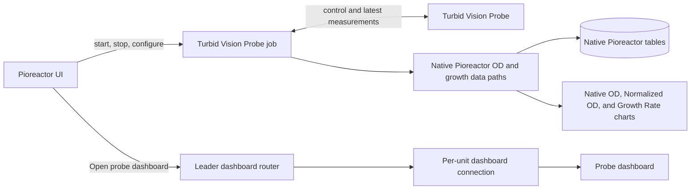

# Turbid Vision Probe for Pioreactor

This plugin connects a Reacgen Biosystems Turbid Vision Probe to Pioreactor as
one Pioreactor job. It uses Pioreactor's native optical-density,
normalized-OD, and growth-rate data paths; it does not create replacement
charts or measurement tables.

The probe performs the optical measurement. When a calibration is active, it
reports culture density; otherwise, it reports its optical signal. Its optional
growth model supplies normalized measurements and, when calibrated, growth
rate. The plugin makes those results behave like native Pioreactor data and
keeps each experiment's starting measurement consistent across job restarts.



For the calibrated and uncalibrated data flows, normalization lifecycle, and
dashboard routing, see [Integration architecture](docs/INTEGRATION.md).

## Requirements

| Component | Requirement |
|---|---|
| Pioreactor | 26.5.2 or newer; tested against upstream 26.8.1 |
| Probe firmware | 2.2.0 or newer |
| Hardware | Probe connected to I2C bus 1 at its standard address |
| Dashboard access | Probe and Pioreactor leader mutually reachable on a trusted private network |

The wheel has no extra runtime dependencies. It uses libraries already shipped
with Pioreactor.

## Installation

Download the release wheel, copy it to the Pioreactor leader, and install it on
every unit that may use a probe:

```bash
pios plugins install turbidvision-pioreactor \
  --source /path/to/turbidvision_pioreactor-0.1.0-py3-none-any.whl
```

For one unit only, run this on that unit:

```bash
pio plugins install turbidvision-pioreactor \
  --source /path/to/turbidvision_pioreactor-0.1.0-py3-none-any.whl
```

The installer adds the job, shared configuration, and dashboard connections.
It also removes obsolete Turbid Vision charts, tables, exports, and split jobs
from development versions of the plugin.

## Starting the job

Use the **Turbid Vision Probe** activity in Pioreactor. Pioreactor 26.8.1 cannot
display a checkbox for a plugin startup option, so **Advanced** accepts
`enable_growth_model` as `0` or `1`:

- `0`: measure and publish OD only; disable measurement normalization and the
  probe growth model.
- `1`: enable measurement normalization and the probe growth model; when a
  calibration is active, also publish growth rate.

Clicking **Off** beneath the activity uses the configured default. Every start
applies the selected settings again because they may have been changed through
the probe dashboard while the Pioreactor job was stopped.

The only runtime value displayed by the plugin is **Turbid Vision Growth Model
Enabled**.

## Shared configuration

The installer creates these entries in Pioreactor's shared configuration:

```ini
[turbidvision_probe.config]
# Seconds between Pioreactor polling the Turbid Vision Probe for its latest measurement. This does not change the probe's measurement rate. Minimum 0.5; default 5.
interval=5
# 0 publishes OD only; 1 enables measurement normalization and calibrated growth rate.
enable_growth_model=0
```

`interval` controls how often Pioreactor asks for the latest completed
measurement. The probe measures independently, so a shorter polling interval
does not make it measure faster. It only reduces the possible delay before
Pioreactor receives a new result. Valid values are `0.5` seconds or greater;
there is no maximum interval.

`enable_growth_model` must be `0` or `1`.

## Probe dashboard links

- **Control** for one Pioreactor opens that unit's probe dashboard directly.
- **Control All Pioreactors** opens a selector showing the dashboard state for
  all assigned, active units.

Each worker reads dashboard network details from its attached probe. The leader
automatically uses the probe's `.local` name and falls back to its IP address if
necessary. It creates a local dashboard connection for each worker, so no
per-worker address configuration is required.

The probe's Wi-Fi setup hotspot is not available through Pioreactor. If the
probe has not joined Wi-Fi, the UI asks the user to connect it to a network the
leader can reach. Measurements can continue through the data cable when the
dashboard network connection is unavailable.

## Important operating limits

- Do not run Pioreactor's built-in OD job against the same optical workflow at
  the same time. Only the Turbid Vision Probe job should communicate with the
  probe.
- Use a new experiment if the probe calibration state or calibration changes.
- Dosing automation compatibility is not implemented or claimed.
- Sensor blanking remains available only through the probe dashboard and is out
  of scope for this integration.
- Dashboard connections have no added authentication. Use them only on a
  trusted private network and never expose them directly to the public internet.
- Multiworker/multiprobe routing is implemented but still awaiting a physical
  multi-probe bench test.
- Stable dashboard ports across leader rebuilds and a more advanced secure
  remote-access layer are deferred.

See [Troubleshooting](docs/TROUBLESHOOTING.md) for common operator-facing
conditions.

## Uninstallation

```bash
pios plugins uninstall turbidvision-pioreactor
```

The uninstall hook removes only this plugin's background services and dashboard
connections, then restarts the affected Pioreactor web services.

## License

MIT. See [LICENSE.txt](LICENSE.txt).
