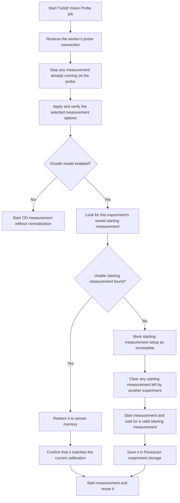
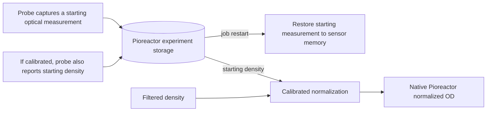
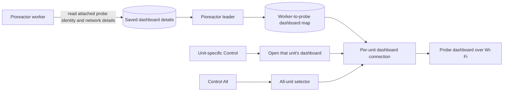

# Integration architecture

This document describes the current runtime behavior for readers familiar with
Pioreactor jobs, experiments, storage, and the frontend. No knowledge of the
probe's internal firmware is required.

## Ownership and startup

`turbidvision_probe` is the only Pioreactor job that communicates with the
probe during a run. It controls measurement and, when selected, the probe's
growth model. Every start applies the selected settings again. Turning an
option off in Pioreactor therefore also turns it off on the probe, even if it
was previously enabled from the probe dashboard.

Pioreactor marks setup as incomplete before clearing the sensor's previous
starting measurement. If power is lost during this process, the next start
takes a fresh measurement instead of accepting one left by another experiment.

## Polling and native Pioreactor routing

The plugin reads one complete measurement at a time, ignores incomplete or
repeated results, and publishes the values through Pioreactor's native data
paths. Native Pioreactor tables and charts remain authoritative.

| Probe state | Native Pioreactor OD Reading | Native Pioreactor Normalized OD Reading | Native Pioreactor Growth Rate |
|---|---|---|---|
| Uncalibrated, growth model off | Optical measurement displayed in ppm | Not produced | Not produced |
| Uncalibrated, growth model on | Optical measurement displayed in ppm | Filtered normalized measurement, dimensionless | Not produced; growth rate requires a calibration in this integration |
| Calibrated, growth model off | Calibrated density in g/L | Not produced | Not produced |
| Calibrated, growth model on | Calibrated density in g/L | Filtered density divided by the starting density saved for the experiment | Specific growth rate in 1/h |

The ppm conversion is only for display and native Pioreactor storage. The
plugin saves the underlying starting measurement in its original units, so a
display conversion can never change normalization.

The plugin reports the native Pioreactor OD channel angle as 180 degrees. It
publishes the same data shapes expected from native OD and growth jobs, so
stock database ingestion and plots continue to work. It does not start
Pioreactor's growth-rate-calculating job; when enabled, the probe supplies the
filtered value and growth estimate.

## Normalization ownership

The growth model needs a starting measurement. Pioreactor owns the
experiment-level copy so restarting the job does not create a new baseline or
accidentally reuse a value from another experiment.

The saved value is associated with:

- the Pioreactor experiment;
- the Pioreactor unit;
- the physical probe attached to that unit.

For an uncalibrated experiment, Pioreactor saves the starting optical
measurement. For a calibrated experiment, it also saves the corresponding
starting density. On a restart, the plugin restores the optical measurement to
sensor memory and reads it back before measurement begins. It also checks that
the saved value still agrees with the active calibration. If the calibration
state or calibration has materially changed, the job stops and asks the user
to restore it or use a new experiment.

When uncalibrated, the probe already supplies a filtered normalized
measurement, so the plugin publishes it directly. Pioreactor still saves the
starting optical measurement for consistent restarts.

## Dashboard discovery and routing

The probe dashboard runs on the probe and uses Wi-Fi. The measurement data
cable and dashboard network connection are independent.

While the job is stopped, a worker service reads the attached probe's dashboard
details. While the job is running, the job refreshes those details itself so
two processes never try to use the probe connection simultaneously. The leader
updates its worker-to-dashboard map every five minutes.

Automatic routing uses the physical probe identity and first tries its reported
`.local` hostname, which remains stable when the router changes its IP address.
It falls back to the reported IP only when the hostname cannot be resolved. No
per-worker address configuration is required. If two workers appear to point
to the same probe or network address, the plugin reports the conflict instead
of guessing.

## Shutdown and fault behavior

When the Pioreactor job stops normally, it stops probe measurement and releases
the worker's probe connection. If another interface stops the probe during a
run, the plugin stops rather than publishing stale values. Sensor conditions
are translated into operator-facing Pioreactor warnings and errors. A dashboard
network failure produces a warning but does not stop measurements through the
data cable.
